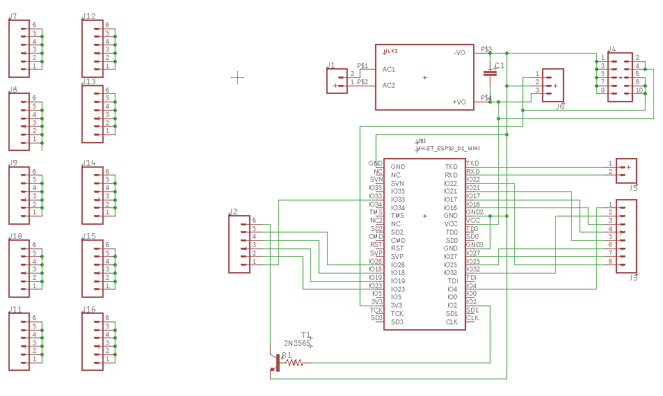
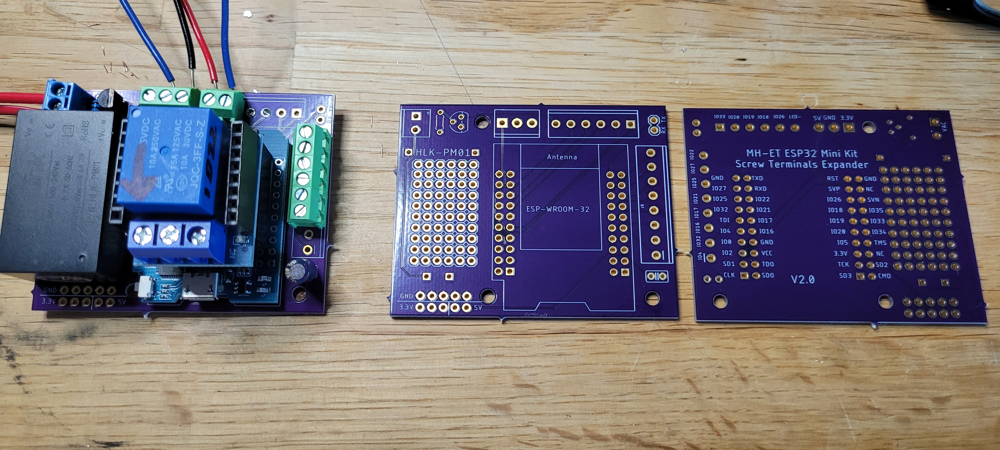

# GPIO Expander for MH-ET ESP32 MiniKit with On-Board A/C Supply

I'm not a board designer, so this is probably very naive, but it works for building ESPHome-based sensors
and other small IoT projects.

Only the GPIOs on the "inner" rows are routed to the terminals, so there is no need to solder all
of the pins on the MiniKit. The NPN transistor (and 10k resistor) can be used to sink an external
LED that mirrors the on-board LED but that requires that GPIO2 be soldered through as it sits on
one of the "outer" rows.

Get bare boards directly from OSHPark: https://oshpark.com/shared_projects/CoKjk6w7

## Parts

* ESP-32 MiniKit: https://www.aliexpress.com/item/2251832629758482.html
* Power Supply: https://www.aliexpress.com/item/2251832424359134.html
* MiniKit Shields: https://www.aliexpress.com/item/2251832856833499.html
* Screw Terminals: https://www.aliexpress.com/item/3256802913222907.html
